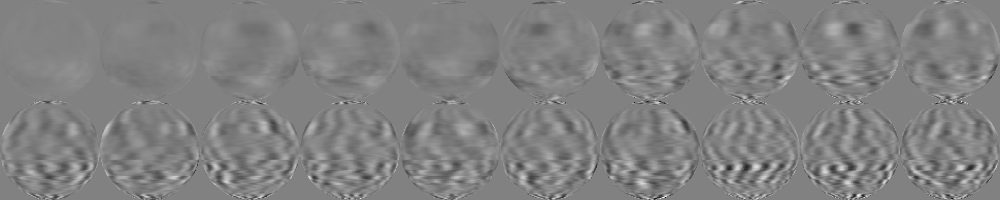
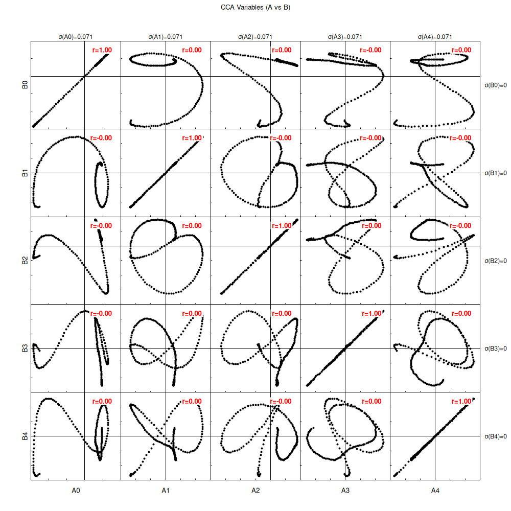
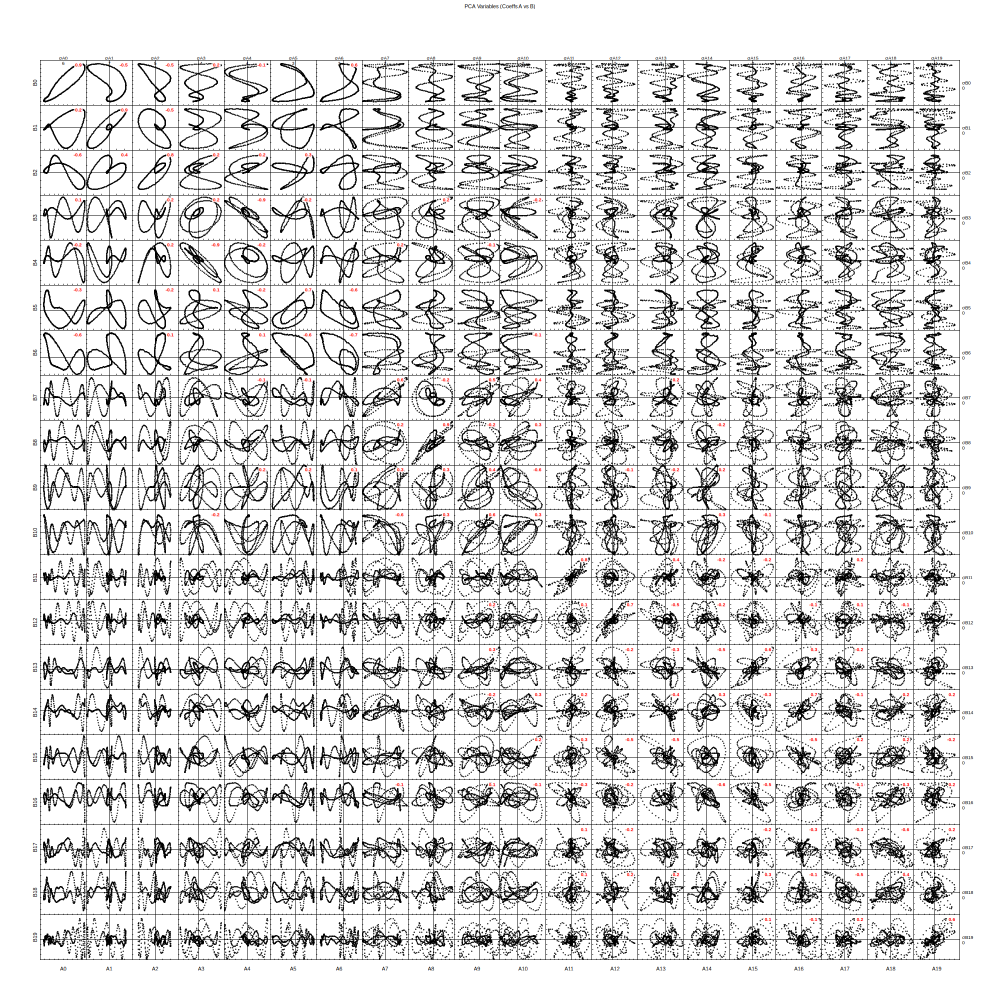

# Milk Stream Telemetry Test Report

This report documents the testing of the Earth sequence generation and analysis tools.

## 1. Earth Datasets Generation

Two simulated datasets were generated representing a rotating Earth from different viewpoints.

**Commands:**
```bash
# Generate Earth A (View: Lat 0, Lon 0)
../build/milk-streamtelemetry-mkearthseq 200 "earthA[0,0]" -speed 1.0 -size 100 100

# Generate Earth B (View: Lat 30, Lon 45)
../build/milk-streamtelemetry-mkearthseq 200 "earthB[30,45]" -speed 1.0 -size 100 100
```

### Earth A


### Earth B


## 2. PCA Analysis

Principal Component Analysis was performed on both datasets (10 modes).

**Commands:**
```bash
# Run PCA
../build/milk-streamtelemetry-pca 10 earthA.fits modesA.fits coeffsA.fits
../build/milk-streamtelemetry-pca 10 earthB.fits modesB.fits coeffsB.fits
```

**Note on Mode 0:** The PCA implementation does NOT re-center (de-average) the input data. Therefore, the first mode (Mode 0) represents the average intensity of the dataset.

### Earth A Modes (First 5)


### Earth B Modes (First 5)


## 3. PCA Reconstruction

The datasets were reconstructed using the computed modes and coefficients.

**Commands:**
```bash
# Reconstruct
../build/milk-streamtelemetry-recon modesA.fits coeffsA.fits reconA.fits
../build/milk-streamtelemetry-recon modesB.fits coeffsB.fits reconB.fits
```

### Earth A Reconstruction


### Earth B Reconstruction


## 4. CCA Analysis

Canonical Correlation Analysis was performed between Earth A and Earth B, using the top 10 PCA modes for data reduction.

**Commands:**
```bash
# Run CCA (5 vectors, using top 10 PCA modes)
../build/milk-streamtelemetry-cca -npca 10 5 earthA.fits earthB.fits
```

### Earth A Canonical Vectors (First 5)


### Earth B Canonical Vectors (First 5)


## 5. Visualization Commands

The PNG images in this report were generated using the `3DFITS-to-png` tool:

```bash
# Visualize Frames
../build/milk-streamtelemetry-3DFITS-to-png earthA.fits earthA_frames.png -n 5 -geom 5x1
../build/milk-streamtelemetry-3DFITS-to-png earthB.fits earthB_frames.png -n 5 -geom 5x1

# Visualize Modes
../build/milk-streamtelemetry-3DFITS-to-png modesA.fits modesA.png -slices 0,1,2,3,4 -geom 5x1
../build/milk-streamtelemetry-3DFITS-to-png modesB.fits modesB.png -slices 0,1,2,3,4 -geom 5x1

# Visualize Reconstruction
../build/milk-streamtelemetry-3DFITS-to-png reconA.fits reconA_frames.png -n 5 -geom 5x1
../build/milk-streamtelemetry-3DFITS-to-png reconB.fits reconB_frames.png -n 5 -geom 5x1

# Visualize CCA
../build/milk-streamtelemetry-3DFITS-to-png ccaAvec.fits ccaA_vectors.png -slices 0,1,2,3,4 -geom 5x1
../build/milk-streamtelemetry-3DFITS-to-png ccaBvec.fits ccaB_vectors.png -slices 0,1,2,3,4 -geom 5x1
```


## 8. Correlation Matrix of Canonical Variables

The following table shows the Pearson correlation coefficients between canonical variables $ and $.

| A \ B | B0 | B1 | B2 | B3 | B4 |
|---|---|---|---|---|---|
| **A0** | **1.0000** | 0.0000 | 0.0000 | 0.0000 | 0.0000 |
| **A1** | 0.0000 | **0.9999** | 0.0000 | 0.0000 | 0.0000 |
| **A2** | 0.0000 | 0.0000 | **0.9999** | 0.0000 | 0.0000 |
| **A3** | 0.0000 | 0.0000 | 0.0000 | **0.9998** | 0.0000 |
| **A4** | 0.0000 | 0.0000 | 0.0000 | 0.0000 | **0.9997** |

## 6. CCA variables

Scatter plots of canonical variables $ vs $. The diagonal (=j$) should show the strongest correlations.
Correlation $ is shown on each plot. $\sigma$ values indicate standard deviation of the variables.



### CCA Gnuplot Script
```gnuplot
set terminal pngcairo size 1000,1000 enhanced font "Arial,10"
set output "./cca_corner.png"

# Define style for boxed labels
set style textbox opaque noborder
set style fill solid 1.0 noborder

# Use margins to leave space for outer labels, spacing 0,0 to touch plots
set multiplot layout 5,5 rowsfirst title "CCA Variables (A vs B)" margins 0.06, 0.94, 0.06, 0.92 spacing 0,0

# Pre-calculate standard deviations
array stdA[5]
array stdB[5]
do for [k=1:5] {
    stats "./cca_vars.dat" u k nooutput
    stdA[k] = STATS_stddev
    stats "./cca_vars.dat" u (k+5) nooutput
    stdB[k] = STATS_stddev
}

do for [j=0:4] {
    do for [i=0:4] {
        colA = i + 1
        colB = j + 6

        # Calculate Correlation
        stats "./cca_vars.dat" u colA:colB nooutput
        corr = STATS_correlation

        # Reset labels
        unset label

        # Correlation Label (Top Right): Bold Red, White Box
        set label 1 sprintf("r=%.2f", corr) at graph 0.90, 0.90 right font "Arial-Bold,10" textcolor rgb "red" front boxed

        # Standard Deviation Labels
        # Top of Column
        if (j == 0) {
            set label 2 sprintf("σ(A%d)=%.2g", i, stdA[i+1]) at graph 0.5, 1.05 center font "Arial,9"
        }
        # Right of Row
        if (i == 4) {
            set label 3 sprintf("σ(B%d)=%.2g", j, stdB[j+1]) at graph 1.05, 0.5 left font "Arial,9"
        }

        # Axis Labels (Outer Only)
        set format x ""
        set format y ""
        unset xlabel
        unset ylabel
        unset xtics
        unset ytics

        # Restore tics structure but no values (or remove ticks completely?)
        # User said "remove the values on the x and y axes ticks", imply ticks might remain?
        # But for corner plot usually inner ticks are removed.
        # Let's keep ticks but remove format as requested.
        set tics scale 0.5

        if (j == 4) { set xlabel sprintf("A%d", i) }
        if (i == 0) { set ylabel sprintf("B%d", j) offset 1 }

        unset key
        # Make plots square-ish? 'set size square' can mess with layout filling.
        # With spacing 0,0, layout determines size. 'set size ratio 1' might create gaps.
        # Let's rely on layout.

        # Zero Cross
        set xzeroaxis lt 1 lc rgb "black"
        set yzeroaxis lt 1 lc rgb "black"

        plot "./cca_vars.dat" using colA:colB pt 7 ps 0.5 lc rgb "black"
    }
}
unset multiplot
```

## 7. PCA variables

Scatter plots of PCA coefficients $ vs $.



### PCA Gnuplot Script
```gnuplot
set terminal pngcairo size 1000,1000 enhanced font "Arial,10"
set output "./pca_corner.png"

# Define style for boxed labels
set style textbox opaque noborder
set style fill solid 1.0 noborder

# Use margins to leave space for outer labels, spacing 0,0 to touch plots
set multiplot layout 5,5 rowsfirst title "PCA Variables (Coeffs A vs B)" margins 0.06, 0.94, 0.06, 0.92 spacing 0,0

# Pre-calculate standard deviations
array stdA[5]
array stdB[5]
do for [k=1:5] {
    stats "./pca_vars.dat" u k nooutput
    stdA[k] = STATS_stddev
    stats "./pca_vars.dat" u (k+5) nooutput
    stdB[k] = STATS_stddev
}

do for [j=0:4] {
    do for [i=0:4] {
        colA = i + 1
        colB = j + 6

        # Calculate Correlation
        stats "./pca_vars.dat" u colA:colB nooutput
        corr = STATS_correlation

        # Reset labels
        unset label

        # Correlation Label (Top Right): Bold Red, White Box
        set label 1 sprintf("r=%.2f", corr) at graph 0.90, 0.90 right font "Arial-Bold,10" textcolor rgb "red" front boxed

        # Standard Deviation Labels
        # Top of Column
        if (j == 0) {
            set label 2 sprintf("σ(A%d)=%.2g", i, stdA[i+1]) at graph 0.5, 1.05 center font "Arial,9"
        }
        # Right of Row
        if (i == 4) {
            set label 3 sprintf("σ(B%d)=%.2g", j, stdB[j+1]) at graph 1.05, 0.5 left font "Arial,9"
        }

        # Axis Labels (Outer Only)
        set format x ""
        set format y ""
        unset xlabel
        unset ylabel
        unset xtics
        unset ytics

        # Restore tics structure but no values (or remove ticks completely?)
        # User said "remove the values on the x and y axes ticks", imply ticks might remain?
        # But for corner plot usually inner ticks are removed.
        # Let's keep ticks but remove format as requested.
        set tics scale 0.5

        if (j == 4) { set xlabel sprintf("A%d", i) }
        if (i == 0) { set ylabel sprintf("B%d", j) offset 1 }

        unset key
        # Make plots square-ish? 'set size square' can mess with layout filling.
        # With spacing 0,0, layout determines size. 'set size ratio 1' might create gaps.
        # Let's rely on layout.

        # Zero Cross
        set xzeroaxis lt 1 lc rgb "black"
        set yzeroaxis lt 1 lc rgb "black"

        plot "./pca_vars.dat" using colA:colB pt 7 ps 0.5 lc rgb "black"
    }
}
unset multiplot
```
