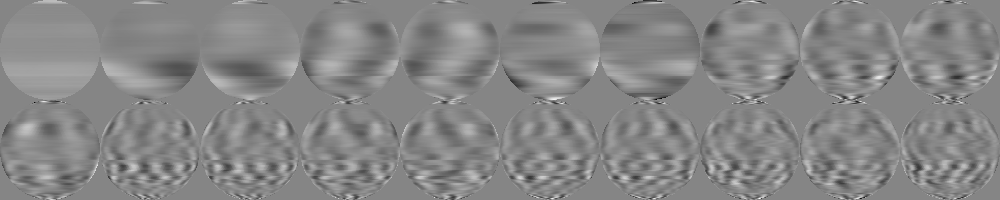

# Milk Stream Telemetry Test Report

## Earth Datasets

Two simulated datasets were generated representing a rotating Earth from different viewpoints.

### Earth A (View: Lat 0, Lon 0)

### Earth B (View: Lat 30, Lon 45)

## PCA Analysis

Principal Component Analysis was performed on both datasets (10 modes). Below are the first 5 spatial modes.

**Note on Mode 0:** The PCA implementation does NOT re-center (de-average) the input data. Therefore, the first mode (Mode 0) represents the average intensity of the dataset.

### Earth A Modes

### Earth B Modes

